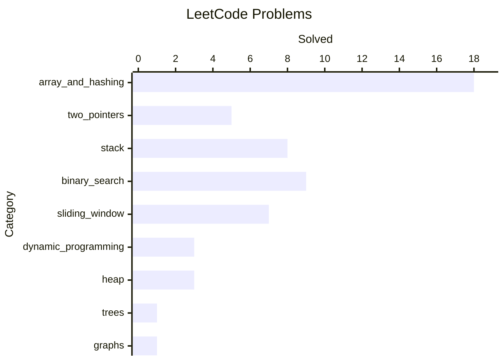

# Leetcode_Gym

This project contains the problems I solved from Leetcode and its variants in multiple languages.

## Overview

## Framework to solve problems

Source: [*Cracking the Coding Interview 6th Ed.* by Gale Laakman McDowell](https://amzn.to/4a7D9Ka)

## Solved

### Arrays and Hashing [18]

- [X] [1. Two Sum](./array_and_hashing/1_two_sum/problem.md)

- [X] [36. Valid Sudoku](./array_and_hashing/36_valid_sudoku/problem.md)

- [X] [49. Group Anagrams](./array_and_hashing/49_group_anagrams/problem.md)

- [X] [128. Longest Consecutive Sequence](./array_and_hashing/128_longest_consecutive_sequence/problem.md)

- [X] [217. Contains Duplicate](./array_and_hashing/217_contains_duplicates/problem.md)

- [X] [238. Product of Array Except Self](./array_and_hashing/238_product_of_array_except_self/problem.md)

- [X] [242. Valid Anagram](./array_and_hashing/242_valid_anagram/problem.md)

- [X] [271. Encode and Decode Strings](./array_and_hashing/271_encode_and_decode_strings/problem.md)

- [X] [347. Top K Frequent Elements](./array_and_hashing/347_top_k_frequent_elements/problem.md)

- [X] [3270. Find the Key of the Numbers](./array_and_hashing/3270_find_the_key_of_the_numbers/problem.md)

- [X] [3271. Hash Divided String](./array_and_hashing/3271_hash_divided_string/problem.md)

- [X] [3274. Check if Two Chessboard Squares Have the Same Color](./array_and_hashing/3274_check_if_two_chessboard_squares_have_the_same_color/problem.md)

- [X] [3280. Convert Date to Binary](./array_and_hashing/3280_convert_date_to_binary/problem.md)

- [X] [3289. The Two Sneaky Numbers of Digitville](./array_and_hashing/3289_the_two_sneaky_numbers_of_digitville/problem.md)

- [X] [3541. Report Spam Message](./array_and_hashing/3541_report_spam_message/description.md)

- [X] [3606. Minimum Element After Replacement With Digit Sum](./array_and_hashing/3606_minimum_element_after_replacement_with_digit_sum/description.md)

- [X] [3510. Maximize the Total Height of Unique Towers](./array_and_hashing/3510_maximize_the_total_height_of_unique_towers/description.md)

- [X] [3605. Construct the Minimum Bitwise Array I](./array_and_hashing/3605_construct_the_minimum_bitwise_array_i/description.md)

### Two Pointers [5]

- [X] [11. Container With Most Water](./two_pointers/11_container_with_most_water/problem.md)

- [X] [15. 3Sum](./two_pointers/15_3sum/problem.md)

- [X] [42. Trapping Rain Water](./two_pointers/42_trapping_rain_water/problem.md)

- [X] [125. Valid Palindrome](./two_pointers/125_valid_palindrome/problem.md)

- [X] [167. Two Sum II - Input Array Is Sorted](./two_pointers/167_two_sum_II_input_array_is_sorted/problem.md)

### Stack [8]

- [X] [20. Valid Parentheses](./stack/20_valid_parentheses/problem.md)

- [X] [22. Generate Parentheses](./stack/22_generate_parentheses/problem.md)

- [X] [84. Largest Rectangle in Histogram](./stack/84_largest_rectangle_in_histogram/problem.md)

- [X] [150. Evaluate Reverse Polish Notation](./stack/150_evaluate_reverse_polish_notation/problem.md)

- [X] [155. Min Stack](./stack/155_min_stack/problem.md)

- [X] [739. Daily Temperatures](./stack/739_daily_temperatures/problem.md)

- [X] [853. Car Fleet](./stack/853_car_fleet/problem.md)

- [X] [3282. Reach End of Array With Max Score](./stack/3282_reach_end_of_array_with_max_score/problem.md)

### Binary Search [9]

- [X] [4. Median of Two Sorted Arrays](./binary_search/4_median_of_two_sorted_arrays/problem.md)

- [X] [33. Search in Rotated Sorted Array](./binary_search/33_search_in_rotated_sorted_array/problem.md)

- [X] [74. Search a 2D Matrix](./binary_search/74_search_a_2d_matrix/problem.md)

- [X] [153. Find Minimum in Rotated Sorted Array](./binary_search/153_find_minimum_in_rotated_sorted_array/problem.md)

- [X] [704. Binary Search](./binary_search/704_binary_search/problem.md)

- [X] [875. Koko Eating Bananas](./binary_search/875_koko_eating_bananas/description.md)

- [X] [981. Time Based Key-Value Store](./binary_search/981_time_based_key_value_store/problem.md)

- [X] [3281. Maximize Score of Numbers in Ranges](./binary_search/3281_maximize_score_of_numbers_in_ranges/problem.md)

- [X] [3611. Construct the Minimum Bitwise Array II](./binary_search/3611_construct_the_minimum_bitwise_array_ii/description.md)

### Sliding Window [7]

- [X] [3. Longest Substring Without Repeating Characters](./sliding_window/3_longest_substring_without_repeating_characters/problem.md)

- [X] [121. Best Time to Buy and Sell Stock](./sliding_window/121_best_time_to_buy_and_sell_stock/problem.md)

- [X] [424. Longest Repeating Character Replacement](./sliding_window/424_longest_repeating_character_replacement/problem.md)

- [X] [3258. Count Substrings That Satisfy K-Constraint I](./sliding_window/3258_count_substrings_that_satisfy_k-constraint_i/problem.md)

- [X] [3573. Count Substrings That Can Be Rearranged to Contain a String I](./sliding_window/3573_count_substrings_that_can_be_rearranged_to_contain_a_string_i/description.md)

- [X] [3570. Count of Substrings Containing Every Vowel and K Consonants I](./sliding_window/3570_count_of_substrings_containing_every_vowel_and_k_consonants_i/description.md)

- [X] [567. Permutation in String](./sliding_window/567_permutation_in_string/description.md)

### Dynamic Programming [3]

- [X] [3259. Maximum Energy Boost From Two Drinks](./dynamic_programming/3259_maximum_energy_boost_from_two_drinks/problem.md)

- [X] [3290. Maximum Multiplication Score](./dynamic_programming/3290_maximum_multiplication_score/problem.md)

- [X] [3584. Find the Lexicographically Smallest Valid Sequence](./dynamic_programming/3584_find_the_lexicographically_smallest_valid_sequence/description.md)

### Heap [3]

- [X] [3264. Final Array State After K Multiplication Operations I](./heap/3264_final_array_state_after_k_multiplication_operations_I/problem.md)

- [X] [3275. K-th Nearest Obstacle Queries](./heap/3275_k-th_nearest_obstacle_queries/problem.md)

- [X] [3496. Minimum Number of Seconds to Make Mountain Height Zero](./heap/3496_minimum_number_of_seconds_to_make_mountain_height_zero/description.md)

### Trees [1]

- [3286. Find a Safe Walk Through a Grid](./trees/3286_find_a_safe_walk_through_a_grid/problem.md)

### Graphs [1]

- [3561. Remove Methods From Project](./graphs/3561_remove_methods_from_project/description.md)\
